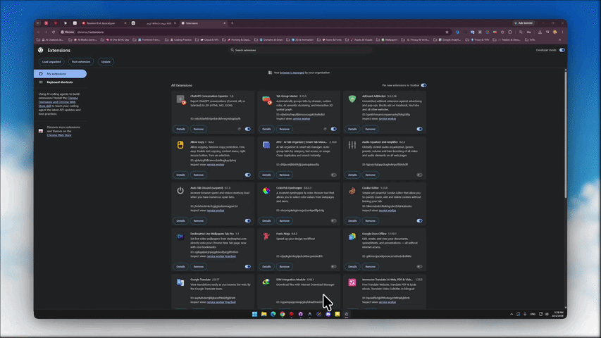
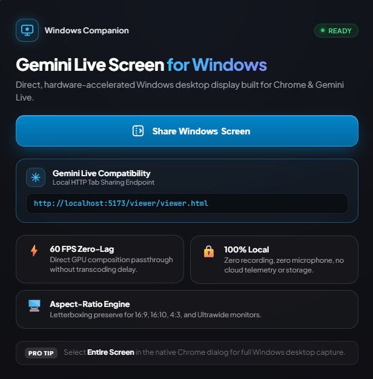

# Gemini Live Screen for Windows (Chrome Extension & Local Companion)

[](tests/)
[](manifest.json)
[](LICENSE)
[-success)](package.json)

A dedicated, lightweight, and high-performance **Gemini Live Screen for Windows** Chrome Extension and companion local server built on **Manifest V3**.

It turns any Chrome browser tab into a live, low-latency, fullscreen display of your Windows desktop for **Gemini Live** and real-time screen sharing without recording, encoding overhead, or external network transmission.

---

<div align="center">
  
  <br />
  
</div>

---

## 📑 Quick Navigation

- [💡 The "Why" & Value Proposition](#-the-why--value-proposition)
- [⚡ Background Capture & Preventing Black Screen](#-background-capture--preventing-black-screen-when-minimized)
- [🚀 Core Features](#-core-features)
- [🔒 Security, Privacy & Least Privilege](#-security-privacy--least-privilege)
- [📁 Repository Structure](#-repository-structure)
- [🛠️ Installation & Setup](#️-installation--setup)
- [📖 Usage Guide](#-usage-guide)
- [⌨️ Keyboard Shortcuts](#️-keyboard-shortcuts)
- [🧪 Automated Testing & Verification](#-automated-testing--verification)
- [📚 Documentation](#-documentation)
- [📄 License](#-license)

---

## 💡 The "Why" & Value Proposition

### 1. The Core Problem
Web-based Multimodal AI models (such as **Google Gemini Live**, browser-based AI agents, and web collaboration tools) natively excel at inspecting and interacting with **browser tabs**, but face severe limitations when attempting to view the full operating system:
- Web AI tools often restrict screen sharing to specific browser tabs or experience frame drops and background freezing when the user switches away from Chrome to native desktop apps (IDE, CAD, Terminal, etc.).
- Traditional solutions require expensive cloud streaming infrastructure, paid VDI software (TeamViewer, AnyDesk), or dedicated capture cards.

### 2. The Solution & Cost Elimination
**Windows Screen Viewer** bridges the entire Windows OS into a dedicated, hardware-accelerated Chrome tab (`http://localhost:5173/viewer/viewer.html` or extension URL):

- **Zero Cloud & Infrastructure Costs ($0/month)**: Eliminates the need for paid screen-relay servers, third-party VDI licenses, or video transcoding backends. Runs 100% locally on existing hardware.
- **Unlocks Desktop Vision for Web AI Agents**: Allows browser-based AI (like Gemini Live) to "see" your entire Windows desktop, multi-monitor setups, and native desktop workflows via standard tab sharing.
- **Background Active Keep-Alive (Zero Freeze)**: Employs a silent Web Audio oscillator loop that prevents Chrome and the Windows GPU compositor from blacking out or throttling the stream when switching to other desktop software.
- **Zero Latency & Near-Zero CPU Overhead**: Leverages direct browser hardware composition via `<video>` elements with zero intermediate re-encoding or disk I/O, preserving battery life and system performance.
- **100% Privacy & Data Security**: No video data ever leaves your local machine. Zero telemetry, zero cloud storage, zero third-party exposure.

---

## ⚡ Background Capture & Preventing Black Screen When Minimized

> ### ⚠️ CRITICAL RULE: Do NOT Minimize the Chrome Window via the OS `_` Button
>
> **Why you must avoid clicking the OS Minimize button (`_`):**
> When a window is explicitly minimized to the Windows Taskbar, Windows Desktop Window Manager (DWM) and Chromium aggressively suspend graphics composition to save power. Even with keep-alive mechanisms, an OS-minimized window will experience dropped frames or black screen freezes.
>
> **How to properly keep the viewer streaming in the background (Recommended Methods):**
> 1. **Layer Behind Active Windows (Direct App Switching)**: Do **not** click minimize (`_`). Simply click on your IDE, editor, terminal, or game. Leaving Chrome open behind your active application maintains full hardware rendering at 60 FPS without freezing.
> 2. **Windows Virtual Desktop (`Win + Ctrl + D` / `Win + Tab`)**: Move the Chrome viewer window to a secondary Virtual Desktop. This clears your primary workspace completely while keeping the window actively rendering in memory.
> 3. **Secondary Monitor / Tiled Split**: Place the Chrome tab on a secondary display or snap it to a background tile.

---

---

## 🚀 Core Features

- **Direct Live Desktop Display**: View your primary monitor or secondary displays directly inside a dedicated Chrome tab.
- **Hardware-Accelerated Zero-Lag Playback**: Direct `<video>` element rendering via native browser composition with zero intermediate transcoding.
- **Background Active Keep-Alive**: Employs a silent Web Audio oscillator loop to prevent Chrome and the Windows GPU compositor from throttling or blacking out background tabs.
- **Aspect-Ratio Preserved Letterboxing**: Enforces `object-fit: contain` on a pure black stage—no stretching, distortion, or cropping across 16:9, 16:10, 21:9 ultrawide, or 4:3 displays.
- **One-Click & Keyboard Fullscreen**: Instant toggle into borderless browser fullscreen with automatic cursor and HUD auto-hiding during inactivity.
- **Clean Lifecycle Management**: Seamlessly detects when screen sharing stops from the Chrome native banner (`MediaStreamTrack.onended`) and cleanly releases all hardware stream handles.
- **Accessible & Keyboard-First**: Complete keyboard navigation support (`F` for fullscreen, `S` / `Esc` for stop, `Space` to start) with ARIA live announcements and visible focus rings.
- **Companion Local Server**: Lightweight Node.js local host on port 5173 with automatic inactivity shutdown for browser/app integration.

---

## 🔒 Security, Privacy & Least Privilege

This extension strictly adheres to least privilege, local execution, and zero data persistence:

| Security Invariant | Guarantee |
| :--- | :--- |
| **Least Privilege Permissions** | `manifest.json` requires only `desktopCapture` for OS screen streaming. Zero access to browsing history, cookies, storage, or external websites. |
| **No Screen Recording** | No `MediaRecorder`, offscreen canvas frame extraction, video file generation, or stream saving. |
| **No Audio / Microphone Capture** | `audio: false` and `systemAudio: 'exclude'` are strictly enforced on streams. No microphone or speaker streams are opened. |
| **100% Local Processing** | Captured video frames never leave your local browser instance. Zero external network calls, zero analytics, zero telemetry. |
| **Content Security Policy** | Uses strict ES modules with zero `eval()`, zero inline handlers, and zero remote scripts. |

---

## 📁 Repository Structure

```text
openclaw/
├── manifest.json                  # Manifest V3 configuration (desktopCapture permission)
├── server.js                      # Zero-dependency local Node.js server with auto-shutdown
├── package.json                   # Project metadata, test & lint scripts
├── LICENSE                        # MIT License
├── README.md                      # Project front door & overview
├── CONTRIBUTING.md                # Development, test, and contribution guide
├── SECURITY.md                    # Security policy & vulnerability reporting
├── SUPPORT.md                     # Support channels & issue reporting
├── CHANGELOG.md                   # Release history & version notes
├── PROJECT_STATE.md               # Continuous engineering state register
├── background/
│   └── service-worker.js         # Single-responsibility action handler & tab focuser
├── viewer/
│   ├── viewer.html               # Semantic HTML5 viewer layout & ARIA live regions
│   ├── viewer.css                # Dark luxury styling, letterboxing & HUD auto-hide
│   ├── viewer.js                 # DOM event bindings & keyboard shortcuts
│   └── viewer-controller.js      # Core MediaStream lifecycle, error mapper & state engine
├── assets/
│   └── icons/                    # Multi-resolution icons (16px, 32px, 48px, 128px, SVG)
├── docs/
│   └── ARCHITECTURE.md           # In-depth architectural & state machine documentation
├── scripts/
│   └── generate-icons.js         # Helper script for rasterizing icon assets
└── tests/
    ├── manifest.test.js          # Manifest schema & least privilege audit
    ├── viewer-controller.test.js # State transitions & mock media stream lifecycle tests
    ├── background.test.js        # Service worker tab deduplication tests
    ├── invariants.test.js        # Static privacy & zero-recording invariant tests
    └── dom-integration.test.js   # DOM bindings & CSS layout tests
```

---

## 🛠️ Installation & Setup

### Step 1: Download the Project

#### Option A: Clone with Git (Recommended for Developers)
```bash
git clone https://github.com/your-username/gemini-live-screen-windows.git
cd gemini-live-screen-windows
```

#### Option B: Download from GitHub Releases (.zip)
1. Navigate to the **[Releases](../../releases)** section on GitHub.
2. Download the latest `gemini-live-screen-windows-v1.0.0.zip` asset.
3. Extract the `.zip` archive into any permanent directory on your machine (e.g. `D:\Tools\gemini-live-screen-windows`).

---

### Step 2: Load the Extension into Google Chrome

1. Open Google Chrome and go to:
   ```text
   chrome://extensions/
   ```
2. Toggle on **Developer mode** in the top-right corner.
3. Click the **Load unpacked** button in the top-left corner.
4. Select the project directory containing `manifest.json`.
5. Pin the **Gemini Live Screen for Windows** icon to your Chrome toolbar for instant 1-click access.

---

### Step 3: (Optional) Local Companion Server

For tab-based AI integrations such as Gemini Live tab capture:
```bash
# Start the local development server (Node.js 18+)
npm start
```
- Open `http://localhost:5173/viewer/viewer.html` in Chrome.
- The server automatically monitors connection heartbeats and terminates when the viewer window is closed.

---

## 📖 Usage Guide

1. Click the **Windows Screen Viewer** icon in your Chrome toolbar (or open the local URL).
2. The extension automatically opens (or brings into focus) the dedicated viewer page.
3. Click the **Share Screen** button (or press `Space`).
4. In the Chrome native screen picker:
   - Select the **Entire Screen** tab.
   - Choose your Windows monitor.
   - Click **Share**.
5. Your Windows desktop is now live in the tab:
   - Press **`F`** to toggle fullscreen mode.
   - The bottom control HUD automatically fades away after 2.5 seconds of inactivity.
   - Move the mouse anytime to bring the HUD back.
   - Press **`S`** or click **Stop Sharing** (or use Chrome's native stop banner) to end sharing.
   - *(See [Background Capture & Preventing Black Screen](#-background-capture--preventing-black-screen-when-minimized) for backgrounding best practices).*

---

## ⌨️ Keyboard Shortcuts

| Shortcut | Context | Action |
| :--- | :--- | :--- |
| **`Space`** | Idle / Error State | Start screen sharing / Try again |
| **`F`** | Viewing State | Toggle Fullscreen mode |
| **`S`** | Viewing State | Stop screen sharing |
| **`Esc`** | Fullscreen / Viewing | Exit fullscreen / dismiss |

---

## 🧪 Automated Testing & Verification

The project includes an automated test suite executed via Node.js native test runner (`node:test`):

```bash
# Run all automated tests
npm test

# Run syntax and static analysis validation
npm run lint
```

### Test Coverage:
- **Manifest V3 Compliance**: Validates schema, required icons, and verifies permission constraints.
- **Zero Recording & Privacy Invariants**: Statically audits all source files to guarantee no `MediaRecorder`, no audio capture (`audio: false`), and no remote telemetry.
- **Controller & Lifecycle**: Verifies state transitions (`idle` ➔ `requesting` ➔ `viewing` ➔ `idle`), stream cleanup on `track.onended`, track `.stop()` termination, and exception handling for user cancellation.
- **Background Worker**: Tests tab deduplication, window focusing, and URL generation.
- **DOM & CSS Layout**: Validates responsive letterboxing, ARIA live regions, and auto-hiding HUD rules.

---

## ⚡ Background Capture & Preventing Black Screen When Minimized

In Windows, Chrome's **Window Occlusion & Background Throttling** feature may pause tab video rendering when the Chrome window is minimized (`_`), causing screen-reading tools (such as **Gemini Live**) to receive black frames.

To ensure uninterrupted continuous background desktop capture even when minimizing or switching away from Chrome, apply any of the following configurations:

### Method 1: Via Windows Registry Policy (Recommended for Chrome 120+)
In newer Chrome versions, Google graduated this flag into a permanent enterprise policy. Run this command in PowerShell as Administrator:
```powershell
New-Item -Path "HKLM:\SOFTWARE\Policies\Google\Chrome" -Force; Set-ItemProperty -Path "HKLM:\SOFTWARE\Policies\Google\Chrome" -Name "NativeWindowOcclusionEnabled" -Value 0 -Type DWord
```
*Then restart Chrome.*

### Method 2: Via Chrome Shortcut Arguments
Add the following command-line flags to your Chrome desktop shortcut target path:
```text
--disable-features=CalculateNativeWinOcclusion --disable-background-timer-throttling
```

### Method 3: Via Chrome Flags (Modern Chrome Versions)
In `chrome://flags`, search for **throttle** and configure:
- **`Throttle repeated no-damage frames`** ➔ Set to **`Disabled`** *(prevents Chrome from freezing frame updates when windows are static or switched)*.
- **`Throttle Javascript timers in background`** (if present) ➔ Set to **`Disabled`**.
- Click the blue **Relaunch** button at the bottom of Chrome.

---

## 🌐 Local Server Lifecycle (`npm start`)

The local server (`server.js`) includes an automatic, resource-friendly lifecycle manager:
- **On-Demand Startup**: Running `npm start` starts the HTTP server on port `5173`. The server stays patiently listening and will **not** shut down while waiting for you to connect.
- **Heartbeat Monitoring**: While the viewer tab (`http://localhost:5173/viewer/viewer.html`) is open, it sends lightweight background heartbeats to keep the session active.
- **Automatic Shutdown on Close**: Once you close the viewer tab or window, the server detects the disconnection and automatically exits cleanly (`process.exit(0)`), freeing the port and memory with zero persistent background overhead.

---

## 📚 Documentation

- [Architecture & State Machine](docs/ARCHITECTURE.md)
- [Contributing Guide](CONTRIBUTING.md)
- [Security Policy](SECURITY.md)
- [Changelog](CHANGELOG.md)
- [Support Guide](SUPPORT.md)

---

## 📄 License

This project is licensed under the [MIT License](LICENSE).
